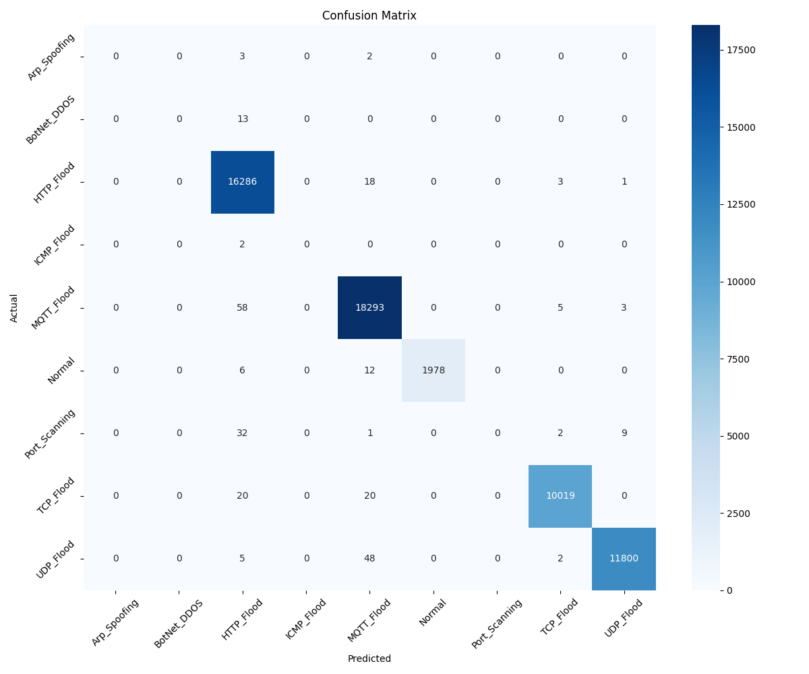
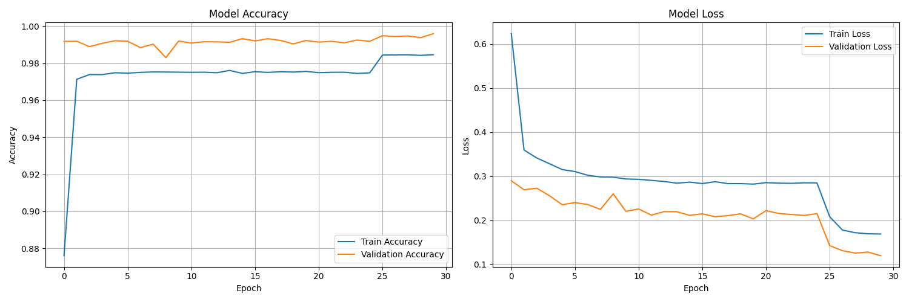

# 🛡️ CNN-BiLSTM Intrusion Detection System  
### Multi-Class Network Attack Detection Using Deep Learning

[](https://www.python.org)
[](https://tensorflow.org)
[](https://keras.io)
[](LICENSE)
[](https://zenodo.org/records/10964648)

---

## 📌 Overview

This repository provides the implementation of an **Enhanced CNN-Bidirectional LSTM (CNN-BiLSTM) model** for real-time multi-class intrusion detection in network traffic.

The hybrid architecture combines:

- **CNN layers** → Spatial feature extraction  
- **Bidirectional LSTM layers** → Temporal dependency modeling  
- **Fully connected layers** → Multi-class classification  

The model achieves:

- ✅ **99.55% Overall Accuracy**
- 📊 **0.99 Weighted F1-Score**
- ⚖️ Performance evaluation on minority attack classes

---

## 📚 Dataset

This project uses the **Farm-Flow | AG-IoT Security Dataset**, designed for intrusion detection in smart agriculture environments.

- 🔗 Source: https://zenodo.org/records/10964648  
- 📦 Size: 1.31M instances (~532 MB)  
- 🎯 Classes: 8 attack types + Normal  

### Attack Types:
- Arp Spoofing  
- BotNet DDoS  
- HTTP Flood  
- ICMP Flood  
- MQTT Flood  
- Port Scanning  
- TCP Flood  
- UDP Flood  

---

## 🏗️ Model Architecture


```

Input (10, 88)
↓
Conv1D (64) → BatchNorm → ReLU → MaxPool → Dropout(0.3)
↓
Conv1D (128) → BatchNorm → ReLU → MaxPool → Dropout(0.3)
↓
Conv1D (256) → BatchNorm → ReLU → MaxPool → Dropout(0.3)
↓
BiLSTM (128) → BiLSTM (64) → Dropout(0.4)
↓
Dense (256) → Dropout(0.5)
↓
Dense (128) → Dropout(0.4)
↓
Dense (9, Softmax)

````


**Total Parameters:** 767,689  

---

## 📊 Results

### 🔹 Overall Performance

| Metric | Score |
|--------|-------|
| Accuracy | 99.55% |
| Weighted F1 | 0.99 |
| Macro F1 | 0.55 |

> ⚠ Note: Lower macro F1 is due to extreme class imbalance in minority attack types.

---

### 🔹 Confusion Matrix

<p align="center">
  
</p>

---

### 🔹 Training Curves

<p align="center">
  
</p>

---

### 🔹 ROC Curves

<p align="center">
  
</p>

---

## 🚀 Getting Started

### 1️⃣ Clone the Repository

```bash
git clone https://github.com/AlirezaRahi/IntrusionDetectionModel.git
cd IntrusionDetectionModel

---

### 2️⃣ Create Virtual Environment

```bash
python -m venv venv
```

Activate:

Windows:

```bash
venv\Scripts\activate
```

Linux / Mac:

```bash
source venv/bin/activate
```

---

### 3️⃣ Install Dependencies

```bash
pip install -r requirements.txt
```

---

### 4️⃣ Download Dataset

Download from Zenodo and extract inside:

```
data/raw/
```

---

### 5️⃣ Run Training

```bash
python main.py
```

---

## 📂 Project Structure

```
IntrusionDetectionModel/
│
├── src/
│   ├── data_preprocessing.py
│   ├── feature_engineering.py
│   ├── model.py
│   ├── train.py
│   └── evaluate.py
│
├── data/
│   ├── raw/
│   ├── processed/
│   └── checkpoints/
│
├── main.py
├── requirements.txt
└── README.md
```

---

## 📈 Output Files

After training:

* `training_history.png`
* `confusion_matrix.png`
* `roc_curves.png`
* `final_results.txt`

---

## 📖 Citation

If you use this work, please cite:

```bibtex
@misc{rahi2026cnnbilstm,
  author = {Rahi, Alireza},
  title = {CNN-BiLSTM Intrusion Detection Model},
  year = {2026},
  publisher = {GitHub},
  url = {https://github.com/AlirezaRahi/IntrusionDetectionModel}
}
```

Dataset:

```bibtex
@dataset{ferreira2024farmflow,
  author = {Ferreira, Rafael et al.},
  title = {Farm-Flow | AG-IoT Security Dataset},
  year = {2024},
  publisher = {Zenodo},
  doi = {10.5281/zenodo.10964648}
}
```

---

## 📄 License

MIT License

---

## 👤 Author

**Alireza Rahi**

* GitHub: [https://github.com/AlirezaRahi](https://github.com/AlirezaRahi)
* LinkedIn: [https://www.linkedin.com/in/alireza-rahi-6938b4154/](https://www.linkedin.com/in/alireza-rahi-6938b4154/)

---

⭐ If you find this repository useful, please consider starring it.

```

---
 
```
